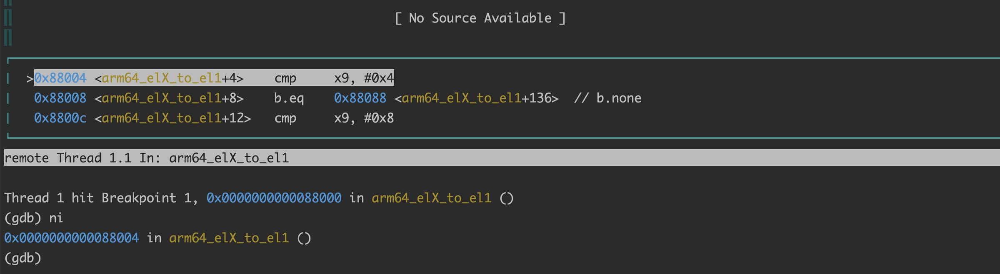
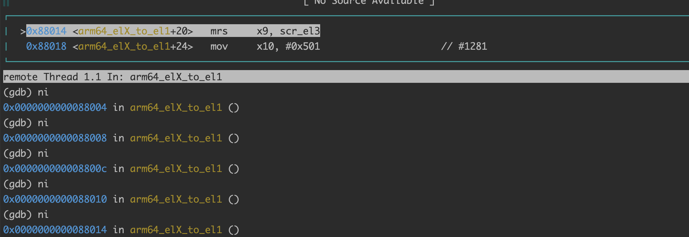
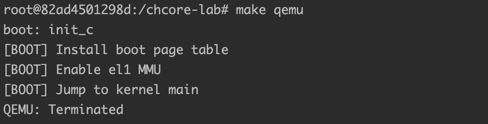

# lab1

### 赵浩如 520021910352

## 思考题1

在多核系统中， `mpidr_el1`作用处于调度需要提供额外的PE（process element）识别机制，它可以帮助确定软件能够确定它在哪个核上执行.
在`_start`的第一行代码`mrs x8, mpidr_el1`,将`mpidr_el1`的值移动到`x8`中，下面一句将使用`and`操作，将`x8`值的`63-8`位置为零，保留`0-7`位，
`0-7`位表示`Affinity level 0`. 这个Affinity等级对于确定PE行为最为重要。更高级别的affinity等级的重要性越低。第三句代码判断`x8`中的值是否是0，如果是`0`的话，才会执行下面的初始化`primary`，由于分配给MPIDR的值的域的集合{Aff2, Aff1, Aff0}在整个系统中必须是不同的，所以只有一个核会执行初始化代码

## 练习题2

添加的代码为

```
mrs x9, CurrentEL
```

这行代码的作用为移动`CurrentEL`中的值到`x9`中，下面需要用`x9`寄存器中的值check当前的exception level.

debug运行效果:


当前还是在`EL3`,所以不会跳转

## 练习题3

添加的代码为

```
    adr x9, .Ltarget
    msr elr_el3, x9
    mov x9, SPSR_ELX_DAIF | SPSR_ELX_EL1H
    msr spsr_el3, x9
```

这段代码的主要工作是设置`EL3`的`exception link register`, 将`ret`位置的`label`设置到这里, 为`eret`做准备，设置`EL3`的状态寄存器`SPSR`, 包括`debug`,`error`, `interrupt`和`fast interrupt`

## 思考题4

C作为一种高级语言，它调用过程机制中的关键特性在于使用了栈数据结构提供的后进先出的内存管理原则，在函数调用的过程中，伴随着参数压栈、返回地址压栈等行为，所以在C函数运行之前需要有栈，如果没有栈的话，C函数可能会出现无法正常传比较多的参数、无法正确返回调用者等情况

## 思考题5

将`.bss`初始化为0是操作系统的任务，如果这里没有初始化的话，C函数如果使用了未初始化的全局变量或者是静态变量，会导致未知的错误

## 练习题6

添加的代码为

```C
void uart_send_string(char *str)
{
        /* LAB 1 TODO 3 BEGIN */
        int i = 0;
        while (*(str + i) != '\0') {
                early_uart_send(*(str + i));
                ++i;
        }
        /* LAB 1 TODO 3 END */
}
```

这段代码的运行效果为


## 练习题7

添加的代码为

```asm
orr     x8, x8, 
```

这个命令的主要功能是将`sctlr_el1`的值写入`x8`,
