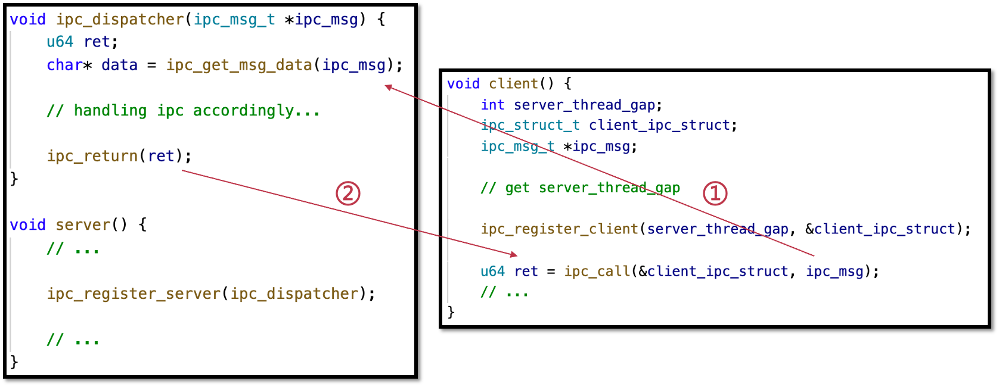

# Review

## lab1

#### chcore初始化的流程

1. 获取当前核的 ID：通过读取系统寄存器 `mpidr_el1` 并使用位操作，将当前核的 ID 存储在寄存器 `x8` 中。
2. 主核初始化流程（Primary Core Initialization）：
   - 检查当前核是否是主核（核 ID 为 0）。
   - 如果是主核，执行以下步骤：
     - 等待 `clear_bss_flag` 标志位清零，确保内存的 BSS 段被正确初始化。
     - 切换到 EL1 特权级（Exception Level 1）。
     - 设置启动时用的栈（用于C的函数调用）
     - 执行主核的初始化流程，调用 `init_c` 函数（跳转到C代码（不再返回到_start函数）
     - `init_c` 完成包括为 `kernel image` 清理 `bss`, 初始化 `UART`, 初始化 `boot page table`, 启用 `MMU` 等一系列工作，最后调用 `start_kernel` 跳转到高地址，进而跳转到内核的 `main`函数
     - 在 `main` 函数中调用 `uart_init` 再完成 `uart`的初始化，调用 `mm_init` 完成内存管理的初始化（buddy system），调用 `arch_interrupt_init()`完成异常向量表的初始化
     
     - 调用函数 `create_root_thread `, 创建第一个 `user thread`，具体的工作是：
     
       a. 创建 `root_cap_group`
     
       b. 在 `root_cap_group` 中创建 `root_thread`
     
       c. 使用 `switch_to_thread` 将当前线程切换为 `root_thread`
     
     - 使用 `switch_context`获取设置成栈指针寄存器的上下文指针。
     
     - 调用 `eret_to_thread` 完成上下文的切换，完成了内核模式和用户模式的切换，开始在用户模式下运行代码
3. 其他核初始化流程（Secondary Core Initialization）：
   - 对于非主核，执行以下步骤：
     - 等待主核设置的启用标志位 `secondary_boot_flag` 变为非零。
     - 设置当前核的 ID 到寄存器 `x0`，调用 `secondary_init_c` 函数执行其他核的初始化流程。

## lab3

#### syscall流程

ChCore中的系统调用是通过使用汇编代码直接跳转到`syscall_table`中的
相应条目来处理的。请阅读`kernel/arch/aarch64/irq/irq_entry.S`中的代码，并简要描述ChCore是如何将系统调用从异常向量分派到系统调用表中对应条目的。

在`irq_entry.S`中定义了异常向量表`el1_vector`，并用`EXPORT`导出使得其他文件中可以访问到,异常向量表中每个条目都是`exception_entry`, 这是在`irq_entry.S`的开头定义的宏，主要作用是首先保证$2^7$对齐，然后用相对跳转的方式跳转到`label`指示的位置。

对于`syscall`,根据异常向量表的指示，首先会跳转到`sync_el0_64`对应的位置，首先使用`exception_enter`完成上下文的保存，然后将异常状态表征寄存器`esr_el1`的内容赋给`x25`，比较其`[31:26]`位对应的位置是否和`0b010101`相等，如果相等，说明该异常对应的是AArch64状态下的SVC指令执行，从而跳转到`el0_syscall`的位置进行`syscall`的处理。

在`irq_entry.S`的开头，通过`.extern`引用了`syscall_table`，这是一个由`syscall`处理函数指针构成的数组，在`el0_syscall`中的处理逻辑中，会根据`system_table`和`syscall_number`找到对应的`syscall`的`handler`函数，通过`ldr`指令跳转到相应的地方执行，最后将返回值写入栈指针对应的位置，恢复上下文。

#### 进程创建流程

第一步：创建虚拟地址空间vmspace
第二步：加载代码和数据
第三步：创建堆
第四步：创建主线程
分配栈空间 （栈的vmregion和相应的pmobject）

## lab4

#### spawn

Spawn最终要实现功能是用户给定一个二进制的路径，其可以创建一个新的进程，执行该二进制，并返回新创建的进程的主线程cap以及进程的pid。由于到目前为止，实验中还未实现文件系统服务，进程管理器还不能直接从文件系统中读取二进制。这里采取与内核创建第一个`Root thread`相似的方法，将本实验需要执行的二进制一同放到`procm.srv`的二进制中，并使用`extern`符号的方法找到该二进制读出来。因此本实验的`spawn`暂时只支持特定二进制的启动。具体代码请阅读`userland/servers/procm/spawn.c`。

为了让ChCore运行的用户态程序能够连接到各系统服务器（例如本节实现的`procm`，以及后面实验将实现的文件系统/网络栈等），在`spawn`创建新的进程时，还需要将所有的系统服务器的`cap`均传给该进程。在配置好该进程的所有参数之后，`spawn`将调用`launch_process`来创建进程。其基本工作流如下：

1. 使用`__chcore_sys_create_cap_group`创建一个子进程。
2. 如果有需要传输的初始cap（比如系统服务的cap，用于后续ipc调用系统服务），则传输这些cap。
3. 使用`__chcore_sys_create_pmo`来创建一个新的内存对象，用作主线程的栈，大小为`MAIN_THREAD_STACK_SIZE`。
4. 构建初始执行环境并写入栈顶。
5. 将二进制elf中每个段以及栈映射到相应位置。这里可以使用`chcore_pmo_map_multi`，其一次性把需要映射的pmo传入内核映射。除了最基本的`cap`，`addr`和`perm`，这里还有一个`free_cap`。其代表是否顺带将当前进程的`pmo`的`cap`释放掉。由于是帮助新进程创建的`cap`，在映射后当前进程的`cap`无需保留，因此应该都将`free_cap`设置为`1`。
6. 创建新进程的主线程。

#### chcore间的进程通信

1. **建立通信连接**

   - 服务端进程在内核中注册服务
   - 客户端进程向内核申请连接目标服务端进程的服务
     - 可选: 设置共享内存
   - 内核将客户端请求请求转发给服务端
   - 服务端告诉内核同意连接 (或拒绝)
     可选: 设置共享内存
   - 内核建立连接，并把连接的Capability返回给客户端或返回拒绝

2. **通信过程** **(** **发起通信** **)**

   - 客户端进程通过连接的Capability发起进程间通信请求

   - 内核检查权限，若通过则继续步骤3，否则返回错误

   - 内核直接切换到服务端进程执行 (不经过调度器)

   - 将通信请求的参数设置给服务端进程的寄存器中

   - 服务端处理完毕后，通过与步骤3相反的过程将返回值传回客户端

