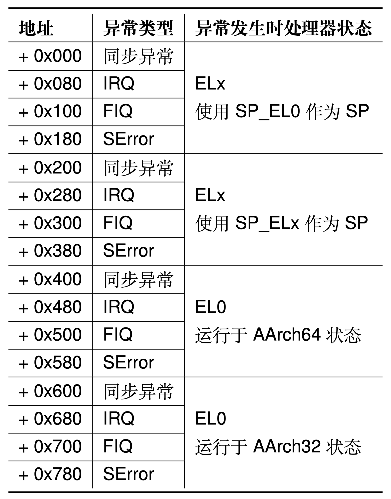

# 实验 3：进程与线程、异常处理

用户进程是操作系统对在用户模式运行中的程序的抽象。在实验 1 和实验 2 中，已经完成了内核的启动和物理内存的管理，以及一个可供用户进程使用的页表实现。现在，我们将一步一步支持用户态程序的运行。

本实验包括三个部分：

1. 使用对应的数据结构，支持创建、启动并管理用户进程和线程。
2. 完善异常处理流程，为系统添加必要的异常处理的支持。
3. 正确处理部分系统调用，保证用户程序的正常执行与退出。

> 注意：建议 `make grade` 时关掉其它 QEMU 进程，以防止出现问题。

## 第一部分：用户进程和线程

本实验的 OS 运行在 AArch64 体系结构，该体系结构采用“异常级别”这一概念定义程序执行时所拥有的特权级别。从低到高分别是 EL0、EL1、EL2 和 EL3。每个异常级别的具体含义和常见用法已在课程中讲述。

ChCore 中仅使用了其中的两个异常级别：EL0 和 EL1。其中，EL1 是内核模式，`kernel` 目录下的内核代码运行于此异常级别。EL0 是用户模式，`userland` 目录下的用户库与用户程序代码运行在用户模式下。

在 ChCore 中，内核提供给用户的一切资源均采用 **Capability** 机制进行管理，所有的内核资源（如物理内存等）均被抽象为了**内核对象（kernel object）**。Capability 可以类比 Linux 中的文件描述符（File Descriptor）。在 Linux 中，文件描述符即相当于一个整型的 Capability，而文件本身则相当于一个内核对象。ChCore 的一个进程是一些对特定内核对象享有相同的 Capability 的线程的集合。ChCore 中的每个进程至少包含一个主线程，也可能有多个子线程，而每个线程则从属且仅从属于一个进程。

```c
// 一个 cap_group，作为一个进程的抽象
struct cap_group {
        // 该进程有权访问的内核对象的数组（内核对象在数组中的索引即为该对象的 cap）
        struct slot_table slot_table;
        // 从属于该进程的所有线程的链表
        struct list_head thread_list;
        int thread_cnt;
        u64 pid;
        // 便于调试使用的进程名字
        char cap_group_name[MAX_GROUP_NAME_LEN + 1];
};

struct thread {
        // 用于记录所属 cap_group 对象的链表节点
        struct list_head node;
        // Lab 3 不使用 ready_queue_node、sem_queue_node
        struct list_head ready_queue_node;
        struct list_head sem_queue_node;
        struct thread_ctx *thread_ctx; // TCB
        // Lab 3 不使用
        struct thread *prev_thread;
        // 虚拟地址空间
        struct vmspace *vmspace;
        // 所属进程
        struct cap_group *cap_group;
        // Lab 3 不使用
        void *general_ipc_config;
	struct ipc_connection *active_conn;
};
```

ChCore 中进程和线程相关的概念已经介绍完毕。在本实验中，我们仅会创建一个包含单线程的用户进程，并仅启用一个 ID 为 0 的 CPU 来运行该进程。与多核和线程调度相关的内容将在实验 4 中实现。由于目前 ChCore 中尚无文件系统，所有用户程序镜像将以 ELF 二进制的形式（通过 `kernel/incbin.tpl.S`）直接嵌入到内核镜像中，以便内核直接启动。

> 思考题 1: 内核从完成必要的初始化到用户态程序的过程是怎么样的？尝试描述一下调用关系。

创建用户程序至少需要包括创建对应的 cap_group、加载用户程序镜像并且切换到程序。在内核完成必要的初始化之后，内核将会跳转到第一个用户程序中，该操作通过调用 `create_root_cap_group` 函数完成。此外，用户程序也可以通过 `sys_create_cap_group` 系统调用创建一个全新的 `cap_group`。由于 `cap_group` 也是一个内核对象，因此在创建 `cap_group` 时，需要通过 `obj_alloc` 分配全新的 `cap_group` 和 `vmspace` 对象。对分配得到的 `cap_group` 对象，需要通过 `cap_group_init` 函数初始化并且设置必要的参数。对分配得到的 `vmspace` 对象则需要调用 `cap_alloc` 分配对应的槽（slot）。

> 练习题 2: 在 `kernel/object/cap_group.c` 中完善 `cap_group_init`、`sys_create_cap_group`、`create_root_cap_group` 函数。在完成填写之后，你可以通过 Cap create pretest 测试点。**注意通过这里的测试并不代表完全实现正确，后续在实验 4 中会再次测试这一部分。**

然而，完成 `cap_group` 的分配之后，用户程序并没有办法直接运行，还需要将用户程序 ELF 的各程序段加载到内存中。

> 练习题 3: 在 `kernel/object/thread.c` 中完成 `load_binary` 函数，将用户程序 ELF 加载到刚刚创建的进程地址空间中。

然而，目前任何一个用户程序并不能正常退出，`hello.bin` 不能正常输出结果。这是由于程序中包括了 `svc #0` 指令进行系统调用。由于此时 ChCore 尚未配置从用户模式（EL0）切换到内核模式（EL1）的相关内容，在尝试执行 `svc` 指令时，ChCore 将根据目前的配置（尚未初始化，异常处理向量指向随机位置）执行位于随机位置的异常处理代码，进而导致触发错误指令异常。同样的，由于错误指令异常仍未指定处理代码的位置，对该异常进行处理会再次出发错误指令异常。ChCore 将不断重复此循环，并最终表现为 QEMU 不响应。后续的练习中将会通过正确配置异常向量表的方式，对这一问题进行修复。

## 第二部分：异常向量表

由于 ChCore 尚未对用户模式与内核模式的切换进行配置，一旦 ChCore 进入用户模式执行就再也无法返回内核模式使用操作系统提供其他功能了。在这一部分中，我们将通过正确配置异常向量表的方式，为 ChCore 添加异常处理的能力。

在 AArch64 架构中，异常是指低特权级软件（如用户程序）请求高特权软件（例如内核中的异常处理程序）采取某些措施以确保程序平稳运行的系统事件，包含**同步异常**和**异步异常**：

- 同步异常：通过直接执行指令产生的异常。同步异常的来源包括同步中止（synchronous abort）和一些特殊指令。当直接执行一条指令时，若取指令或数据访问过程失败，则会产生同步中止。此外，部分指令（包括 `svc` 等）通常被用户程序用于主动制造异常以请求高特权级别软件提供服务（如系统调用）。
- 异步异常：与正在执行的指令无关的异常。异步异常的来源包括普通中 IRQ、快速中断 FIQ 和系统错误 SError。IRQ 和 FIQ 是由其他与处理器连接的硬件产生的中断，系统错误则包含多种可能的原因。本实验不涉及此部分。

发生异常后，处理器需要找到与发生的异常相对应的异常处理程序代码并执行。在 AArch64 中，存储于内存之中的异常处理程序代码被叫做异常向量（exception vector），而所有的异常向量被存储在一张异常向量表（exception vector table）中。



AArch64 中的每个异常级别都有其自己独立的异常向量表，其虚拟地址由该异常级别下的异常向量基地址寄存器（`VBAR_EL3`，`VBAR_EL2` 和 `VBAR_EL1`）决定。每个异常向量表中包含 16 个条目，每个条目里存储着发生对应异常时所需执行的异常处理程序代码。以上表格给出了每个异常向量条目的偏移量。

在 ChCore 中，仅使用了 EL0 和 EL1 两个异常级别，因此仅需要对 EL1 异常向量表进行初始化即可。在本实验中，ChCore 内除系统调用外所有的同步异常均交由 `handle_entry_c` 函数进行处理。遇到异常时，硬件将根据 ChCore 的配置执行对应的汇编代码，将异常类型和当前异常处理程序条目类型作为参数传递，对于 sync_el1h 类型的异常，跳转 `handle_entry_c` 使用 C 代码处理异常。对于 irq_el1t、fiq_el1t、fiq_el1h、error_el1t、error_el1h、sync_el1t 则跳转 `unexpected_handler` 处理异常。

> 练习题 4: 按照前文所述的表格填写 `kernel/arch/aarch64/irq/irq_entry.S` 中的异常向量表，并且增加对应的函数跳转操作。

## 第三部分：缺页异常和系统调用

页错误在操作系统中扮演了重要的作用，是延迟内存分配的重要技术手段。当处理器发生缺页异常时，它会将发生错误的虚拟地址存储于 `FAR_ELx` 寄存器中，并异常处理流程。本实验需要完成缺页异常的处理。

> 练习题 5: 填写 `kernel/arch/aarch64/irq/pgfault.c` 中的 `do_page_fault`，需要将缺页异常转发给 `handle_trans_fault` 函数。

进入 `handle_trans_fault` 函数后，首先需要找到出现 fault 的地址所对应的 vmr，如果 vmr 不存在，那么将终止处理流程。在寻找到地址所对应的 vmr 之后，寻找其映射的物理内存对象（PMO），我们的缺页处理主要针对 `PMO_SHM` 和 `PMO_ANONYM` 类型的 PMO，这两种 PMO 的物理页是在访问时按需分配的。缺页处理逻辑首先尝试检查 PMO 中当前 fault 地址对应的物理页是否存在（通过 `get_page_from_pmo` 函数尝试获取 PMO 中 offset 对应的物理页）。若对应物理页未分配，则需要分配一个新的物理页，将将页记录到 PMO 中，并增加页表映射。若对应物理页已分配，则只需要修改页表映射即可。

> 练习题 6: 填写 `kernel/mm/pgfault_handler.c` 中的 `handle_trans_fault`，实现 `PMO_SHM` 和 `PMO_ANONYM` 的按需物理页分配。

系统调用是系统为用户程序提供的高特权操作接口。在本实验中，用户程序通过 `svc` 指令进入内核模式。在内核模式下，首先操作系统代码和硬件将保存用户程序的状态。操作系统根据系统调用号码执行相应的系统调用处理代码，完成系统调用的实际功能，并保存返回值。最后，操作系统和硬件将恢复用户程序的状态，将系统调用的返回值返回给用户程序，继续用户程序的执行。

> 练习题 7: 按照前文所述的表格填写 `kernel/arch/aarch64/irq/irq_entry.S` 中的 `exception_enter` 与 `exception_exit`，实现上下文保存的功能。如果正确完成这一部分，可以通过Bad Instruction 1、Bad Instruction 2、Fault测试点，并可以在运行 `badinst1.bin`、`badinst2.bin` 时正确输出如下结果：
>
> ```
> [INFO] Exception type: 8
> ```

> 思考题 8： ChCore中的系统调用是通过使用汇编代码直接跳转到`syscall_table`中的
> 相应条目来处理的。请阅读`kernel/arch/aarch64/irq/irq_entry.S`中的代码，并简要描述ChCore是如何将系统调用从异常向量分派到系统调用表中对应条目的。

在本实验中，你需要实现三个基本的系统调用，分别是 `sys_putc`（用于向终端输出一个字符）、`sys_getc`（用于从终端获取一个字符）和 `sys_thread_exit`（用于退出当前线程）。针对退出用户态程序这一操作，用户态程序在退出之后，需要通过系统调用将控制权交还给内核。内核需要将当前线程移出调度队列，并继续从调度队列中选择下一个可执行的线程进行执行。然而，由于目前 ChCore 中仅包含一个线程，因此，在唯一的用户线程退出后，ChCore 将中止内核的运行并直接退出。实验 4 会对这一问题进行修复。

> 练习题 9: 填写 `kernel/syscall/syscall.c` 中的 `sys_putc`、`sys_getc`，`kernel/object/thread.c` 中的 `sys_thread_exit`，`libchcore/include/chcore/internal/raw_syscall.h` 中的 `__chcore_sys_putc`、`__chcore_sys_getc`、`__chcore_sys_thread_exit`，以实现 `putc`、`getc`、`thread_exit` 三个系统调用。

到这里，你的程序应该可以通过所有的测试点并且获得满分。

> 挑战题 10: 截止到现在由于没有磁盘，因此我们采用一部分内存模拟磁盘。内存页是可以换入换出的，请设计一套换页策略（如 LRU 等），并在 `kernel/mm/pgfault_handler.c` 中的 `handle_trans_fault` 实现你的换页方法。
